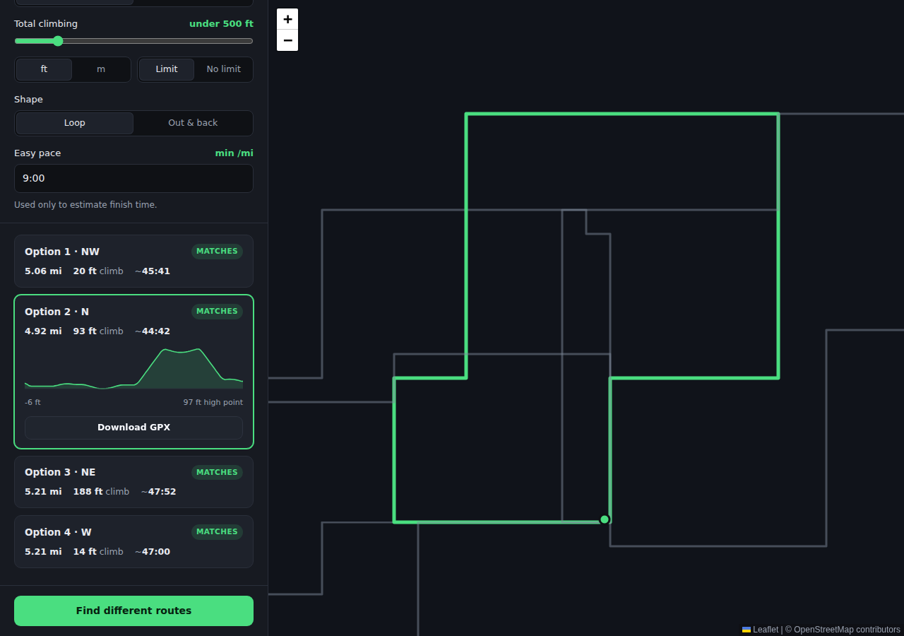

# LoopMaker

Enter what you want to run — distance, how much climbing you're willing to do,
where you're starting — and get back real routes drawn on a map that begin and
end at your door.

> "A five mile run from here, under 500 feet of climbing, finishing back where
> I started."



> **Also in this repo:** [PodBrief](podcast-summarizer/) — paste a Spotify
> podcast link, get every point from the episode summarized, installable on an
> iPhone. See [podcast-summarizer/README.md](podcast-summarizer/README.md).

## What it does

- **Loops that come home.** Routes start and finish at the same point, so
  there's no car shuffle and no doubling back unless you ask for it.
- **Hits your distance.** Candidate loops are refined against a real routing
  engine until the routed distance lands within a few percent of your target —
  not the straight-line distance, the distance you'll actually run.
- **Respects your climbing limit.** Every route is sampled against elevation
  data and filtered on total ascent, so "flat five miles" means flat.
- **Gives you options.** Several distinct routes in different directions, not
  one take-it-or-leave-it suggestion. "Find different routes" reshuffles.
- **Remembers the ones you liked.** Star a route and it's kept on the device,
  whole — so it opens instantly next time and starts with no connection at all.
- **Tells you how the run went.** Finish a loop and you get distance, time,
  measured pace and climbing, with one tap to save the route.
- **Keeps the navigation simple.** Ask for fewer turns and it builds rounder,
  straighter loops and ranks them by how little you'll have to think. Every
  route shows its turn count.
- **Elevation profile.** Scrub the profile to see exactly where the hills are
  on the map.
- **Sends to your phone.** On an iPhone, the share sheet hands the GPX straight
  to Strava, Garmin, Files or AirDrop. Everywhere else it downloads.
- **Turn-by-turn navigation.** Hit **Start run** for a tilted, heading-up view
  like driving directions: the next turn, the street it's onto, and the distance
  counting down — spoken aloud too, so you needn't look at the screen.
- **Follows you as you run.** A live dot on the route, distance done and left,
  and a warning when you drift off the line — so you don't need a watch.
- **Installs on your phone.** Add to Home Screen gives it an icon, a full
  screen with no browser chrome, and an app that opens without a signal.

Loop or out-and-back, miles or kilometres, feet or metres. Built for the phone
you'll actually hold at the front door: safe-area aware, no zoom-on-focus, and
sized for thumbs.

## Running it

```bash
npm install
npm run dev      # http://localhost:5173
```

### Installing it on an iPhone

Open the site in **Safari**, tap **Share**, then **Add to Home Screen**. It gets
an icon, launches full screen, and opens offline. iOS only offers this from
Safari — Chrome on iOS has no Add to Home Screen.

```bash
npm run build    # typecheck + production bundle into dist/
npm test         # unit tests
```

No API keys, no account, no build-time configuration.

## How route finding works

Generating a loop of a given length is harder than point-to-point routing,
because you don't know the waypoints in advance — you only know the shape you
want. LoopMaker works backwards from the target:

1. **Spread candidates around the compass.** Each candidate claims a different
   bearing, so the results genuinely differ instead of being one loop redrawn.
2. **Guess a radius.** A loop of circumference *D* starts from the polygon
   inscribed in a circle of that perimeter, deliberately undershot — streets
   are always longer than the ideal shape.
3. **Refine against the router.** Route through the waypoints, compare the
   routed distance to the target, scale the radius by the ratio, repeat. Three
   or four passes land inside the tolerance.
4. **Sample the terrain.** Resample the route to 100 evenly spaced points and
   look up elevation for each.
5. **Score and filter.** Rank on distance error, ascent overage and turn
   density, drop near-duplicates, return the best few.

### Turns are a preference, not a limit

Distance and climbing are stated constraints: a route either satisfies them or
it doesn't. Turns are different — you'd rather have fewer, but you wouldn't
reject a good run over one extra corner. So turn count never disqualifies a
route, it only orders the ones that already qualify.

Asking for fewer turns also changes what gets built, not just what gets shown:
the loop is generated from a triangle rather than a pentagon, giving longer legs
along single roads. Turns are counted per kilometre, since a 10 km route
naturally has more corners than a 5 km one without being harder to follow. Only
real decisions count — a road bending gently or changing name under your feet
isn't something you have to remember.

### Elevation is smoothed, deliberately

Raw digital-elevation samples are noisy enough that naively summing every rise
can report roughly double a route's true ascent. Every figure here is smoothed
with a moving average, then accumulated with a hysteresis threshold — a rise
only counts once it clears 3 m above the last confirmed low. Wobble below that
is treated as sensor noise, while genuine gradual climbs still accumulate in
full.

## Data sources

All keyless and public:

| Purpose   | Service                                   |
| --------- | ----------------------------------------- |
| Map tiles | OpenStreetMap                             |
| Routing   | OSRM (FOSSGIS walking profile)            |
| Elevation | Open-Meteo Elevation API (Copernicus DEM) |
| Search    | Nominatim                                 |

These are community-run, fair-use endpoints. Requests are serialised per host
with a minimum gap between them, retried with backoff, and elevation lookups
are cached per coordinate. For heavy or commercial use, swap in your own
routing and elevation endpoints — both are injected as providers
(`RoutingProvider`, `ElevationProvider`), so it's a one-line change in
`src/App.tsx`. The same seam is what lets the search algorithm be tested
against a synthetic city.

Swapping the map for Google Maps means replacing `MapView.tsx`; nothing else
depends on Leaflet.

### Why there's no "open this route in Apple Maps"

Apple's URL scheme carries a single destination. There is no parameter for a
list of waypoints, let alone a polyline, so a loop cannot be expressed as a
Maps link at all. The honest substitutes are both here: **Send to phone** puts
the GPX into the iOS share sheet, which is how routes actually reach Strava,
Garmin and Files; and **Directions to start** opens Apple Maps walking
directions to the start line, which is the one thing its URL scheme can do.

## Layout

```
src/
  lib/
    geo.ts           great-circle maths, resampling, interpolation
    elevation.ts     smoothing and hysteresis ascent accumulation
    routeSearch.ts   candidate generation, refinement, scoring   <- the core
    turns.ts         which maneuvers count as a turn worth remembering
    follow.ts        matching a live GPS fix to a point on the route
    navigation.ts    turn instructions, distances and what to say next
    effort.ts        grade-adjusted finish-time estimate
    gestures.ts      double-tap detection, kept away from the DOM to be tested
    direction.ts     running a loop backwards: reversing a route and spotting it
    heading.ts       angle arithmetic, and choosing between compass and course
    runSummary.ts    what actually happened on a run, measured not estimated
    savedRoutes.ts   keeping routes, and recognising one you already have
    gpsFilter.ts     refusing fixes that cannot be true
    gpx.ts           GPX 1.1 export
    share.ts         iOS share sheet, download fallback, Apple Maps links
    units.ts         miles/km, feet/metres, formatting
    __fixtures__/    synthetic grid city used by the tests
  services/          OSRM, Open-Meteo, Nominatim, compass + fair-use HTTP client
  components/        MapView, ControlPanel, RouteList, SavedRoutes, ElevationProfile, NavigationView
public/
  manifest.webmanifest, sw.js, icons     the installable-app layer
```

## Following a run without a watch

Matching a GPS fix to "how far round am I?" is not simply the nearest point on
the line. A loop touches its own start, and often crosses itself partway, so
nearest-point alone makes progress jump backwards. Each fix is therefore matched
within a window around the previous one, which keeps progress moving forward.

Two cases break that window, and both are handled: at the very first fix there
is no previous position, so ties go to the earlier segment — you haven't run it
yet. And when nothing near the last fix is within 60 m, the window itself is
assumed wrong (signal lost under a bridge, or you rejoined the loop elsewhere)
and the whole route is searched again.

The screen is held awake while following, where the browser allows it.

### Running the loop the other way

A loop can be run in either direction, but it is generated in one. Set off the
opposite way and every instruction is wrong: the turns arrive in the wrong
order, point the wrong way, and name the wrong roads.

The direction is worked out from the first real movement away from the start,
by comparing how the runner actually moved against the two ways the route leaves
home. When it comes out backwards the whole route is swapped for the same run
described in reverse, and the runner is told it happened rather than left to
wonder why the directions changed.

Reversing instructions is not reversing a list. A routing engine's step carries
a maneuver *and* the road travelled after it, so going backwards a turn keeps
its junction but takes the *previous* step's road, and left becomes right.
Climbing and descent swap too, since what you went up one way you come down the
other. A roundabout's exit number is dropped rather than guessed, because
counted from the other side it is a different exit.

The check declines to answer in two cases: when the two directions are too alike
to tell apart, which is what an out-and-back looks like; and when the runner is
heading somewhere that is neither way round, which means they are off the route
rather than running it backwards.

### Not believing every fix

Satellite accuracy collapses between tall buildings, which is exactly where
junctions are — so the worst fixes arrive at the moment a runner turns. Three
things keep that off the screen.

Fixes the receiver is unsure of are dropped, as are jumps that would need
impossible speed. A run of bad ones cannot freeze the map forever: after several
refusals the next fix is taken regardless, because a stale position is worse
than an uncertain one. Speed is only judged over intervals a real receiver
reports at; below that the figure is arithmetic on noise.

Deciding the runner is somewhere else on the route takes far more than one fix.
A city loop runs along streets a block apart and often crosses itself, so a poor
fix near a junction can genuinely sit closer to a different part of the route
than the part you are on — which is how a runner ends up thrown blocks away. A
relocation now has to be a decisive improvement, close enough in absolute terms
to be a real match, and confirmed by a second fix that agrees.

While on the route the runner is drawn *on* it rather than at the raw fix. Even
good fixes jitter by a few metres, and a marker that twitches off the line reads
as broken. Stray far enough and the snapping stops, which is what the off-route
warning is for.

### Which way you're facing

Satellites report *course over ground* — the direction you are travelling. It is
null while you stand still and only catches up after several fixes, so a map
driven by it alone lags behind you and ignores turning on the spot entirely.

The compass answers the question that actually matters: which way the phone is
pointing, right now. It is the primary source here, with course over ground as
a fallback for devices without a magnetometer — and even then only above a slow
walking pace, below which its direction is mostly noise.

iOS gates the magnetometer behind a permission request that only works when
called straight from a tap, so the ask happens on the button that starts the
run rather than when the navigation view appears. Readings arrive far faster
than a screen can redraw, so the newest is kept and applied once per frame,
eased the short way round.

### Turn-by-turn

The routing engine describes a route as maneuvers, but to guide someone mid-run
each one needs a position *along* the route, to compare against how far they've
got. Those are found by projecting each maneuver onto the route, walking
forwards only — which keeps them in running order even where a loop crosses its
own path, and stops the closing "you're back at the start" being dragged to
distance zero because it sits on the same spot as the opening instruction.

Each turn is spoken at most once per distance band (400 m, 150 m, 25 m), so you
get a heads-up and a final call rather than a stream of repeats.

Instructions always name the road where the map knows one: the street name
first, then a road number for roads carrying only that, then where the road is
signposted to. Only a genuinely unnamed path gives a bare "Turn left".

Deciding what to announce is a separate question from counting how complicated a
route is. A gentle bend adds nothing to what you have to remember, so it doesn't
count as a turn — but mid-run you still want telling which way the road forks.
Navigation therefore announces every junction with a direction, slight ones
included, while the turn count keeps ignoring them.

### The tilted view

Leaflet draws a flat map, so the perspective is CSS: the map sits in an
oversized "rotor" that is turned to your heading and pitched back with
`rotateX`. Everything inside — tiles, the route line, your position — tilts
together, so nothing drifts out of alignment. Tilting pushes the far edge past
the loaded tiles, so a haze at the horizon reads that as distance rather than as
a missing map.

A true 3D map would mean vector tiles and a rendering library, which in practice
means an API key. That would trade away the thing that makes this app work on
first load with no account at all.

The camera is driven by a single number: where the runner sits on screen. The
map is panned so the runner is at the rotor's centre, so the rotor is shifted
until that centre lands exactly under the on-screen puck. Expressed in the
rotor's own units, that shift has to be divided by how much bigger the rotor is
than the screen — get it wrong and the map centres somewhere the puck isn't,
which is how the runner ends up hidden behind the bottom card.

The route ahead is drawn bright and thick, the ground already covered dimmed
behind, so "which way now" reads without thinking.

### Looking around mid-run

Dragging or pinching the map hands it over: it flattens to north-up, stops
chasing you, and offers a **Re-centre** button. A double tap anywhere does the
same thing.

Flattening isn't cosmetic. Leaflet's pointer maths knows nothing about the CSS
tilt and rotation, so a drag under the tilted camera would move the map in the
wrong direction and by the wrong amount. Dropping the transform the moment a pan
begins is what makes dragging behave the way a finger expects. The container
changes size when it flattens, so Leaflet is told to remeasure — otherwise the
map quietly re-centres on the wrong point.

## Your location

Nothing is asked for on arrival. The app requests your location only when you
tap **Use my current location** or start a run, after saying why.

Coordinates do leave the device, because roads and hills have to be looked up:
they go to the routing, elevation and search services listed above and nowhere
else. There is no account, no analytics and no tracking, and saved routes never
leave your phone.

## Recognising a route you already have

Route identifiers come from the seed and bearing of one particular search, so
the same loop found twice has two different ids. Saved routes are matched by a
signature built from the geometry instead — start point, the centre of the
route's extent, and length rounded to ten metres — which is what lets a star
stay filled when the same loop turns up in a later search.

## Offline

The service worker caches the app shell and the map tiles you've already
loaded, so the app opens and shows familiar ground without a signal. Routing and
elevation requests are never cached: those are answers to a specific question,
and a stale answer is worse than an honest error. Finding new routes therefore
still needs a connection.

## Tests

349 unit tests covering the geodesy, ascent accumulation, turn classification,
GPS-to-route matching, turn instructions and their placement, unit conversion,
GPX output, sharing and its fallbacks, the OSRM adapter, and the search
algorithm end to end.

The search tests run against a synthetic city in `src/lib/__fixtures__` —
streets on a 120 m lattice and terrain that climbs steadily to the east — so
convergence on the target distance, the elevation constraint actually steering
routes toward flat ground, the turn preference measurably lowering turn density,
determinism per seed, de-duplication, and graceful degradation when a routing or
elevation service fails are all verified without touching the network.

```bash
npm test
```

### Browser checks

`tests/` holds two scripts that drive the built app in a real browser against
the same stand-in city. `consistency.mjs` runs six fresh sessions and compares
them; `repeatability.mjs` covers what that cannot — five runs back to back
without reloading, the same again with noisy GPS, and repeated searches in one
session.

The second run in a session is where state carried over from the first shows up,
which is not something a single pass can find.

## Known limits

- Route quality depends on OpenStreetMap footpath coverage; sparsely mapped
  areas give fewer and worse options.
- Elevation comes from a ~30 m DEM, so ascent figures are good estimates rather
  than survey data.
- The router optimises for distance, not for pleasantness — it doesn't know
  which roads have sidewalks or traffic.
