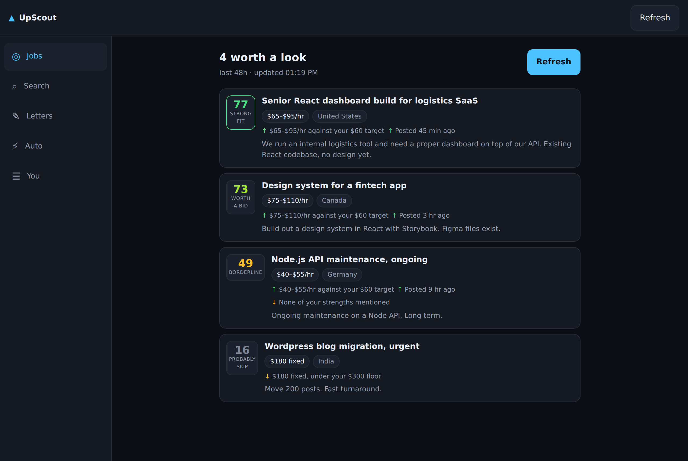

# UpScout

Tell it what work you want. It pulls Upwork postings that match, puts the ones
worth your time at the top with the reasoning shown, drafts the proposal from
your own template, and — if you switch it on — queues the applications for you
to release.

> "React or TypeScript, $60/hr or better, posted in the last day, fewer than
> fifteen bids, payment-verified clients."

Runs in the browser on a laptop and installs to the home screen on an iPhone.
No account, no server: everything stays on the device.



## What it does

- **Ranks, doesn't just filter.** Every job gets a score out of 100 from pay
  against *your* target, skill overlap, how many have already bid, how good the
  client is, how fresh the post is and how much it sounds like your kind of
  work. Criteria are a separate, hard yes/no — so a rule never hides behind a
  low score, and a preference never quietly deletes a job.
- **Shows its working.** Every score opens into the six factors that made it,
  each with a bar and a sentence. "Ranked third because forty people have
  already bid" is a thing you can act on; a mystery number isn't.
- **Never guesses.** A post that doesn't state the client's rating is marked
  unknown, not bad — otherwise the sources that tell you less would sink to the
  bottom regardless of the work.
- **Weights you can move.** If you want the best-paid work rather than the work
  you're most likely to win, drag Pay up and Competition down. The order
  changes as you drag.
- **Writes the proposal.** Your template, filled in from the post and your
  profile: `{{job.title}}`, `{{match.topSkill}}`, `{{client.country}}`, with
  `{{#…}}` sections for lines that should only appear when there's something to
  put in them. Several templates, each with its own keywords, and the one that
  fits the job is picked automatically. Nothing is invented — every value comes
  from the post or from you.
- **Applies, on a leash.** Auto-apply has a score floor, a daily cap, a
  connects budget, a bid ceiling, and approval on by default. It shows you the
  exact list it would send before it sends anything, and the same function
  produces the preview and the run, so the preview can be trusted. A job on
  your avoid list is never sent, whatever it scores, and a letter with a gap in
  it waits for you rather than going out half-written.
- **Tells you when it declined.** Every job it passed over says why: under your
  score, too many bids, already applied, out of connects.
- **Set up once, then just refresh.** Deploy the bridge worker and press
  Connect once; it holds the Upwork connection and renews it, so from then on
  the app fetches when you open it, when you come back to it, on a timer while
  you're looking, and whenever you press Refresh. Nothing to copy, paste or
  re-authorise — on either device.
- **Works before that, too.** Paste a search or a feed in and everything
  downstream behaves identically.
- **Offline.** Jobs, letters, queue and history are on the device, so the app
  opens and stays useful in a tunnel.
- **Moves between devices.** Copy your settings on the laptop, paste them on
  the phone — bridge token included if you ask, so the second device needs no
  setup of its own.

## Running it

```bash
cd apps/upscout
npm install
npm run dev      # http://localhost:5173
npm test         # 113 unit tests over the ranking, filters, letters and limits
npm run build
```

## Getting jobs in

**The setup worth doing once** is the bridge in
[`connector/upwork-bridge`](connector/upwork-bridge): a ~250-line Cloudflare
Worker that holds your Upwork API connection — the OAuth dance, the daily token
renewals, the rotating refresh tokens — and answers `/jobs`. Deploy it, press
**Connect Upwork** on its page, add it under **You → Sources**, press **Check
connection**. After that, Refresh is the whole workflow, and the app also
fetches by itself when you open it, when you come back to it, and every ten
minutes while you're looking (**You → Refreshing** to change or switch off).

A browser page cannot fetch `upwork.com` directly — that's a rule of the web,
not something this app can code around — which is why the bridge exists rather
than a URL box. Its README has the exact commands, and
[`docs/connector.md`](docs/connector.md) covers the JSON contract and the other
source kinds.

**Before that's up:** **Search → Paste jobs in** takes your Upwork search page
or feed, needs no setup at all, and everything downstream is identical.

## Sending

Upwork has no public endpoint for submitting a proposal, so by default sending
is one tap and one paste: the letter goes to your clipboard, the apply page
opens, you set your terms and submit. The queue keeps track of what's
outstanding. If you run a bridge that can submit, point **You → Sending** at it
and the queue posts to it instead — and an application is only ever marked sent
when something confirmed it.

Automating submissions is a decision about your own account and Upwork's terms
of service. The app is built so that finding, ranking and drafting are entirely
yours either way.

## How it's put together

```
src/lib/          the parts that decide things, all pure and all tested
  scoring.ts      six weighted factors → a score, a tier and the reasoning
  criteria.ts     the hard filter, and why each job was dropped
  template.ts     the little {{placeholder}} language and letter drafting
  autoApply.ts    the plan: what would be sent, what wouldn't, and why
  store.ts        device storage, defensive about anything read back
  refresh.ts      when to fetch without being asked
  text.ts         word matching that survives "Node.js" vs "nodejs"
src/services/     talking to the outside world
  sources/        the bridge, RSS, JSON, the Upwork API, pasted text → one shape
  submit.ts       manual and bridge sending
src/components/   the screens
connector/
  upwork-bridge/  the worker that holds the Upwork connection
  feed-passthrough-worker.js   the CORS half of it, for a plain feed
```

The rule the layout follows: anything that makes a decision is a pure function
under `lib/`, so it can be tested without a browser. Components hold no
judgement, only state and layout.
