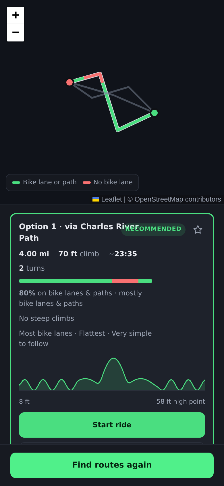
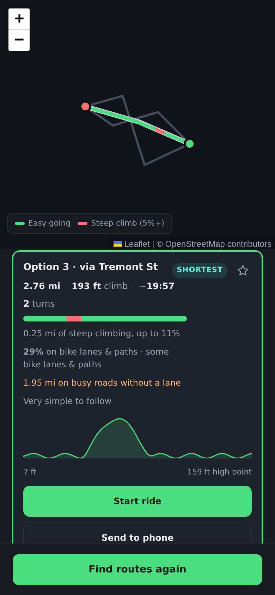
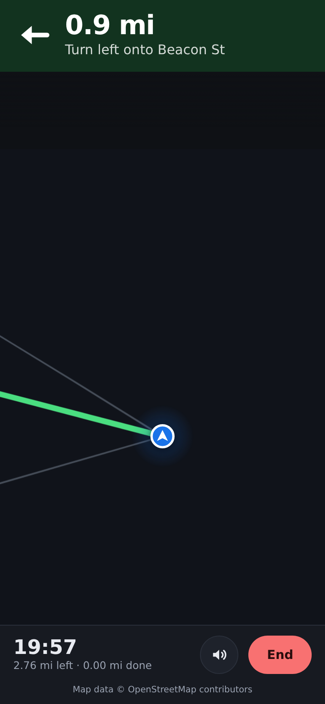

# EasyPedal

The easiest bike ride from A to B. Set where you start and where you're going,
say whether **bike lanes** or **fewer hills** matter more, and get back real
routes drawn on a map — painted by what you'll be riding on — with the same
turn-by-turn navigation LoopMaker uses.

<p>
  
  
  
</p>

## Installing it on an iPhone

It's a web app that installs like a native one. Once the site is deployed
(see below):

1. Open **https://orion0900.github.io/Claude-orion/easypedal/** in **Safari**.
2. Tap **Share**, then **Add to Home Screen**.

That's it. It gets its own icon, launches full screen with no browser chrome,
and opens without a signal. iOS only offers Add to Home Screen from Safari —
Chrome on iOS can't do it. No App Store, no developer account, no build.

### Deploying it

The site deploys itself. Every push to `main` runs
[`.github/workflows/deploy.yml`](../.github/workflows/deploy.yml), which builds
LoopMaker to the root of the GitHub Pages site and EasyPedal into `/easypedal/`
beneath it. Merging this app's branch into `main` is the only step; the
workflow turns Pages on if it isn't already.

## What it does

- **Two ends, not a loop.** Search an address, use your location, or tap the
  map — the panel says which end the next tap sets, and a swap button turns
  the ride around.
- **Bike lanes first, or hills first.** Both halves of "easy" always count; the
  switch decides which one leads when they disagree.
- **Never a highway.** Every route is checked stretch by stretch. Anything on a
  trunk road or motorway is dropped before you see it, and if nothing safe
  exists it says so rather than offering something dangerous.
- **Shows you the lanes.** With bike lanes first, the chosen route is painted
  green where there's a bike lane or path and red where there isn't, on the
  map and on a bar in each card, with the percentage spelled out — "78% on
  bike lanes" is a fact, not a feeling.
- **Shows you the hills.** With fewest hills first, the same route is painted
  red where the climb is steep and green everywhere else, and each card says
  how far you'll be grinding and how steep it gets. Flip the switch and the
  paint follows, no new search needed.
- **Counts the climbing.** Every route is sampled against elevation data and
  reported as total ascent, with a profile you can scrub to see where the hills
  are on the map.
- **Several options.** The recommended route, plus whichever others are the
  flattest, shortest, or have the most lanes.
- **Same directions as LoopMaker.** Route cards, elevation profile, a written
  turn list, GPX to the share sheet, and **Start ride** for a tilted,
  heading-up navigation view with the next turn spoken aloud.
- **Follows you.** A live dot on the route, distance done and left, an
  off-route warning, and a summary at the end with your measured average speed.
- **Remembers your commute.** Star a route and it's kept whole on the phone, so
  it opens instantly and navigates without a connection.

## How it finds the easiest route

Point-to-point routing engines already know how to find *a* route. The work
here is asking for the right ones and telling them apart.

1. **Ask three ways.** The engine's bicycle costing takes two dials: how much
   to avoid roads (`use_roads`) and how much to avoid hills (`use_hills`). The
   rider's priority sets the first two attempts — leaning on that dial, then
   leaning harder — and the third gives the other half of "easy" its turn, so a
   flat route through quiet streets still surfaces when the lanes go the long
   way round. Each attempt also asks for an alternative.
2. **Drop the repeats.** Two answers are the same ride when they're within a few
   percent in length and, sampled at 24 points, never more than 50 m apart.
3. **Walk each route's roads.** The route's own shape is sent back to the
   engine, which returns every stretch with its OpenStreetMap tags: use, road
   class, and whether it carries a cycle lane. Those collapse into six kinds —
   protected, lane, path, quiet, busy, unsafe — and are summed.
4. **Sample the terrain.** 100 evenly spaced points per route, looked up
   against a 30 m elevation model, smoothed and accumulated with the same
   hysteresis LoopMaker uses so DEM noise doesn't double the ascent.
5. **Filter, then rank.** Anything with more than 40 m of highway is out.
   The rest are scored on lane share and climbing, weighted 60/25 in whichever
   order the rider chose, with a small charge for detours and busy roads.

### What counts as steep

Five percent. That's the grade at which a casual rider on an ordinary bike
stops cruising and starts grinding — it roughly halves the speed of someone
doing 18 km/h on the flat — and it's the limit cycling-infrastructure guidance
sets for a comfortable sustained climb. Grade is measured over a window of
about 100 m of the smoothed profile, so a single noisy elevation sample can't
paint a hill that isn't there, and only climbing counts: a sharp descent is
still "easy going", because the question is what you have to pedal up.

### Why lane share is measured rather than trusted

The engine's low `use_roads` setting already favours cycleways, but it never
says how much of the result actually is one. Measuring it means the number on
the card is true for *this* route, and it's also what lets the "hills first"
mode still tell you how many lanes you're giving up.

### What counts as a bike lane

| Kind          | OpenStreetMap                                          |
| ------------- | ------------------------------------------------------ |
| Protected     | `highway=cycleway`, or a physically separated lane     |
| Bike lane     | a painted lane (`cycleway=lane`)                       |
| Shared path   | footways, paths, tracks — no cars, shared with walkers |
| Quiet street  | residential and service roads, or shared-lane markings |
| Busy road     | tertiary and up with nothing for bikes                 |
| Highway       | trunk and motorway — never offered                     |

The first three count as "bike lanes & paths" in the percentage.

## Data sources

All keyless and public:

| Purpose   | Service                                        |
| --------- | ---------------------------------------------- |
| Map tiles | OpenStreetMap                                  |
| Routing   | Valhalla (FOSSGIS), bicycle costing            |
| Road tags | Valhalla `trace_attributes`, same instance     |
| Elevation | Open-Meteo Elevation API (Copernicus DEM)      |
| Search    | Nominatim                                      |

These are community-run, fair-use endpoints. Requests are serialised per host
with a minimum gap, retried with backoff, and elevation lookups are cached per
coordinate. A search is three routing requests plus two more per distinct
candidate. For heavy or commercial use, swap in your own endpoints — routing,
road description and elevation are all injected as providers
(`RoutingProvider`, `WayProvider`, `ElevationProvider`), so it's a one-line
change in `src/App.tsx`. The same seam is what lets the search be tested
against a synthetic town.

## Running it locally

```bash
cd easypedal
npm install
npm run dev      # http://localhost:5173, also on your Wi-Fi for a phone
npm run build    # typecheck + production bundle into dist/
npm test         # unit tests, no network needed
```

No API keys, no account, no build-time configuration.

## Layout

```
src/
  lib/
    routeSearch.ts   asking the engine three ways, measuring, filtering, ranking  <- the core
    bikeway.ts       road tags -> protected / lane / path / quiet / busy / unsafe
    grades.ts        where the steep climbs are, cut from the route to paint
    polyline.ts      the engine's encoded shapes
    effort.ts        ride-time estimate from speed and climbing
    rideSummary.ts   what actually happened on the ride, measured
    geo.ts, elevation.ts, turns.ts, navigation.ts, follow.ts,
    heading.ts, gpsFilter.ts, gestures.ts, savedRoutes.ts,
    gpx.ts, share.ts, units.ts             shared with LoopMaker
    __fixtures__/    synthetic town with a greenway, backstreets and a highway
  services/          Valhalla, Open-Meteo, Nominatim, compass, fair-use HTTP client
  components/        MapView, ControlPanel, RouteList, SavedRoutes, ElevationProfile, NavigationView
public/
  manifest.webmanifest, sw.js, icons     the installable-app layer
```

The navigation, GPS filtering, heading and route-following code is LoopMaker's,
copied rather than imported so each app builds and deploys on its own. Two
things changed for bikes: the speed a fix is allowed to imply is higher, and
turns are announced from further out.

## Your location

Nothing is asked for on arrival. The app requests your location only when you
tap **Use my current location** or start a ride, after saying why. Coordinates
leave the device only to the routing, elevation and search services above.
There is no account, no analytics and no tracking, and saved rides never leave
your phone.

## Tests

Unit tests cover the polyline codec, road classification and the safety rule,
steep-climb detection and its windowing,
the ranking under both priorities, the search end to end against the synthetic
town (highway filtering, de-duplication, degraded operation when a service
fails), the Valhalla adapter's maneuver translation and request shapes, and
everything inherited from LoopMaker — geodesy, ascent accumulation, turn
placement and wording, GPS matching, GPX and sharing.

```bash
npm test
```

## Known limits

- Lane coverage is only as good as OpenStreetMap's tagging. A real bike lane
  that nobody has mapped counts as road.
- Elevation comes from a ~30 m model, so ascent figures are good estimates
  rather than survey data.
- The engine's alternatives are its own idea of different; in a sparse network
  the three attempts may all agree, and you'll get one route.
- Apple Maps can't be handed a route with the roads spelled out, so
  **Directions to start** gets you to the start line and the app takes it from
  there.
