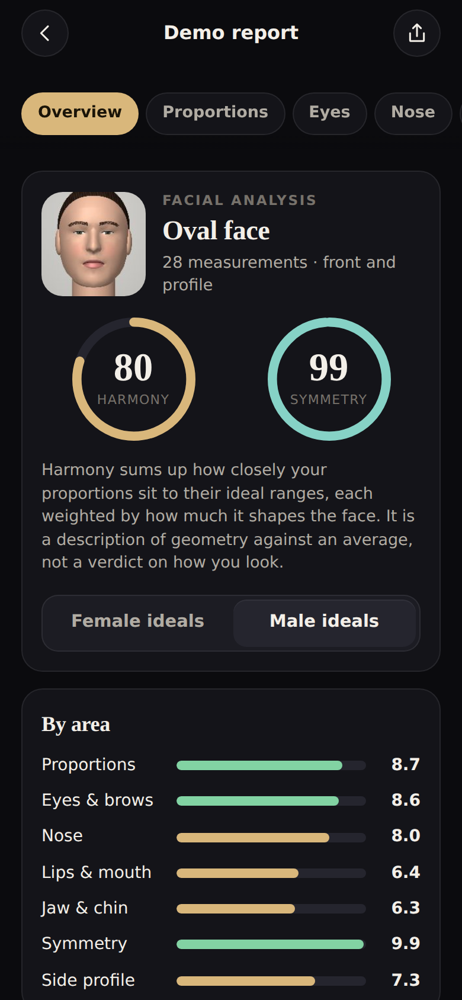
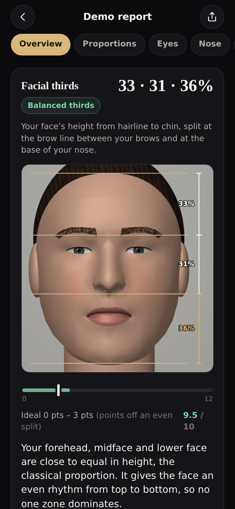
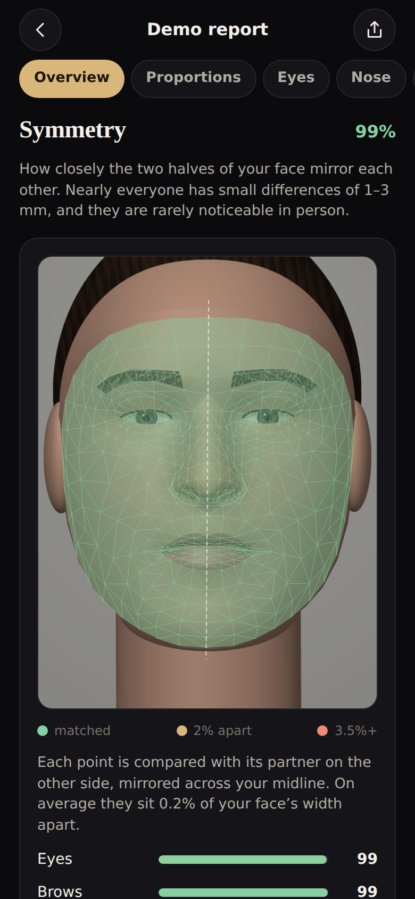
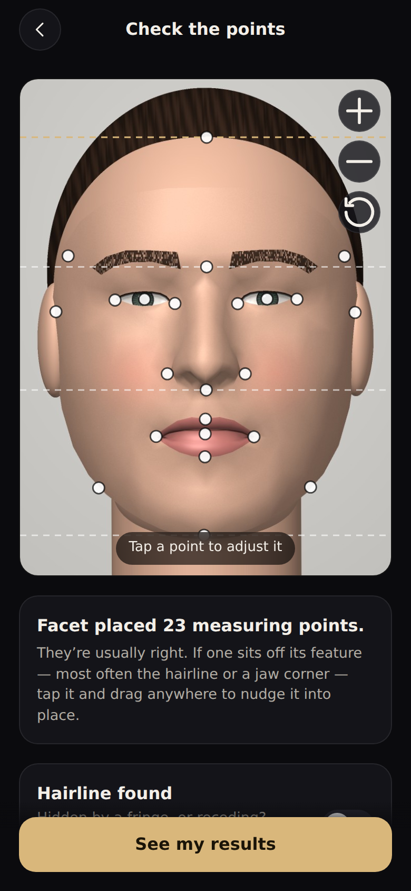
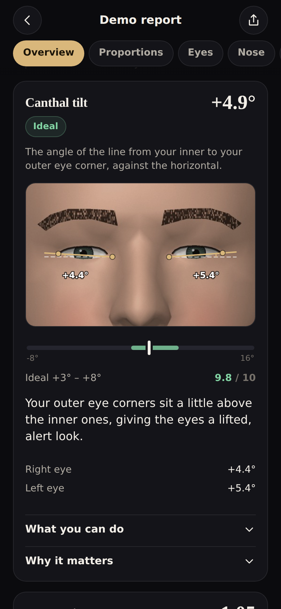
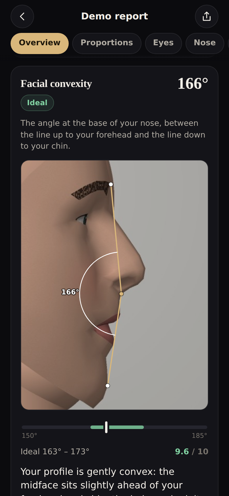

# Facet

A facial analysis for your phone in the spirit of **QOVES Studio**: take one
front photo and Facet measures thirty-odd proportions of your face — facial
thirds and fifths, canthal tilt, eye spacing, nose and mouth widths, lip
ratio, jaw and chin — scores each against its ideal range from aesthetic
research, maps your symmetry point by point, names your face shape and
suggests hair, brow, beard and glasses ideas that suit it. Add a side photo
and it measures your profile too: nose angles and projection, lips against
Ricketts' E-line, chin, jaw angle and the neck–chin line.

> Harmony 84 · Symmetry 96% · Oval face. "Your canthal tilt is +5.6°, inside
> the ideal +4° to +9°. Your lower third runs a little long — here's what
> balances it."

It all runs on the phone. The face-landmark model and its runtime are served
from this site and cached for offline use; your photos never leave the device.

<p>
  
  
  
</p>
<p>
  
  
  
</p>

The face in these screenshots is the built-in demo: rendered from MediaPipe's
canonical face mesh — the average face — rather than a photo of anyone.

## Using it

Open **https://orion0900.github.io/Claude-orion/facet/** on your iPhone. To
install it, tap **Share**, then **Add to Home Screen**; it then opens full
screen and works offline. It works on Android and desktop browsers too.

1. **Pick the ideals** you want to be compared with (female or male — several
   ranges differ). Each report can be switched later.
2. **Take or choose a front photo.** The live camera coaches you — centre,
   distance, head straight, chin level, no smile — and takes the photo by
   itself once you've held still. For the best accuracy have someone take it
   from 1–2 m with the zoom lens and choose it from your library.
3. **Check the points.** Facet places 23 measuring points (hairline, brow
   line, eye corners, nose wings, mouth corners, cheekbones, jaw angles…). Tap
   one and drag anywhere on the photo to nudge it; a loupe shows it magnified.
4. **Read the report**: the harmony and symmetry scores, your strongest and
   most distinctive proportions, ideas to try, your face shape, then every
   measurement on its own card — the photo annotated with exactly what was
   measured, the value against its ideal range, what it means, and what you
   can do (styling first; clinical options, for information only, can be
   hidden in Settings).
5. **Add a side profile** (optional): tap the nose tip, chin and ear and the
   other twelve points are placed for you; step through them to fine-tune.

**See a demo report first** runs the whole analysis on a synthetic face
rendered from the average-face mesh, so you can explore before using a photo
of yourself. History keeps every analysis on the device, and **Compare**
lines two up side by side. **Share** makes a summary card; **Print / PDF**
gives you the whole report.

## What it measures

| Area | Measurements |
| --- | --- |
| Proportions | facial thirds, facial fifths, facial width-to-height ratio, midface ratio, facial index, face shape |
| Eyes & brows | canthal tilt, eye spacing (intercanthal ÷ eye width), eye separation (pupils ÷ face width), eye shape, brow position, brow tilt and arch |
| Nose | nose width ÷ intercanthal distance |
| Lips & mouth | mouth width ÷ nose width, lower ÷ upper lip height |
| Jaw & chin | jaw ÷ cheekbone width, lips-to-chin ÷ nose-to-lips |
| Symmetry | every landmark against its mirrored partner; eye and brow level, mouth tilt, nose and chin deviation, eye size, face halves |
| Side profile | nasofrontal, nasolabial, nasofacial and nasomental angles, tip projection (Goode), facial convexity, upper and lower lip to the E-line, mentolabial, cervicomental, gonial and mentocervical angles |

Millimetres are estimated from the iris, which is close to 11.7 mm across in
nearly every adult; the side profile borrows its scale from the front photo.

## How it works

**Landmarks.** Google's MediaPipe Face Landmarker finds 478 points: the
468-point face mesh plus the irises, with depth for each. Facet picks the
anthropometric landmarks from them. Two corrections were calibrated by eye
against real photos: the mesh's eye corners sit on the lid margins a little
inside the true canthi (the inner one stops at the white, short of the
caruncle), and its widest nose points sit in the crease beside the nostril
wing, so each is nudged a fixed fraction towards the next ring of mesh points.

**Straightening the face.** The face's horizontal comes from every mirrored
landmark pair at once (hundreds of them, so no single feature's asymmetry
tilts it), and the photo is turned upright. Then the 3D landmark cloud is
rotated to face the lens: yaw fully, pitch beyond the few degrees the model
reads on a level head. A head turned five degrees no longer makes one eye
look narrower, and a lowered chin no longer shortens the lower third. Drawings
stay on the real photo; numbers come from the straightened face.

**The hairline.** The mesh stops short of it, so Facet learns the colour of
your forehead's skin (in YCbCr, with a robust spread) and walks up the centre
of the forehead until most of a narrow strip stops matching. A fringe over the
forehead is detected and reported rather than mistaken for a hairline.

**Scoring.** Inside its ideal range a measurement scores 9–10 (10 at the
centre); outside, the score falls away smoothly with distance, a tolerance
costing about three points. Group scores average their measurements by
weight, and the harmony score weights the groups. Descriptive measurements
(eye shape, brow position, facial index) aren't graded: no value is better.
The face shape is the nearest of seven prototypes in four proportions
(length, forehead, jaw, chin taper), reported with the runner-up.

**Photo quality.** Pose, expression (from the model's blendshapes), eyes
open, resolution, exposure, side-lighting, sharpness (Laplacian spread on a
fixed-scale patch) and, when the photo's EXIF gives the lens, the camera
distance — close-up selfies make the nose look wider. Each issue flags the
measurements it undermines.

## The ideal ranges, and their limits

They come from the neoclassical canons, facial anthropometry (Farkas),
profile analysis (Powell & Humphreys, Ricketts) and attractiveness research
such as Pallett, Link & Lee (2010) on eye spacing and the facial
width-to-height studies. They describe averages of the faces studied —
mostly young adults and, in the older literature, mostly of European descent.
A result outside a range marks a difference, nothing more; the report says
so where it matters most (nose width, lips, eyelids).

Facet is for curiosity and styling ideas, not medical advice, and it's
intended for adults.

## Privacy

There's no server. The app, the landmark model (3.7 MB) and its WebAssembly
runtime are static files on this site, cached by a service worker after first
use. Photos and analyses are stored in the browser's IndexedDB on your device
and nowhere else; **Settings → Delete all data** removes them. No account, no
analytics, no tracking.

## Running it

```bash
npm install
npm run dev      # http://localhost:5173
npm run build    # typecheck + production bundle into dist/
npm test         # unit tests
npm run icons    # redraw the PWA icons
node scripts/render-demo.mjs    # re-render the synthetic demo face
```

Browser checks drive the built app in a phone-sized Chromium:

```bash
npm run build
node tests/e2e.mjs                 # intro, analysis, points, report, profile, history, compare
node tests/calibrate.mjs [photos]  # print every measurement for a set of photos
```

They use MediaPipe's own test photos, downloaded once into `tests/.cache`.
Set `SHOTS=<dir>` to save screenshots.

## How it's built

TypeScript, React and Vite; the only runtime dependency beyond React is
`@mediapipe/tasks-vision`, whose WebAssembly files a small Vite plugin serves
from the app's own origin.

- `src/face/` is the analysis, free of the DOM and tested exhaustively against
  a synthetic face built from the canonical mesh: `frame.ts` (the face's own
  axes), `pose.ts` (head pose and straightening), `points.ts` (anthropometric
  points), `pixels.ts` (hairline, lighting, sharpness), `metrics/` (each
  measurement with its drawing, ideals and scoring), `symmetry.ts`,
  `faceShape.ts`, `quality.ts`, `profile.ts` (side profile), `exif.ts`.
- `src/content/` is every word of the report: what each measurement means,
  outcomes, advice, face-shape guides.
- `src/detect/` loads the landmarker and photos; `src/store/` keeps analyses
  in IndexedDB and settings in localStorage.
- `src/ui/` holds the screens and components: the point editor with its
  loupe, annotated photos drawn as SVG over the image, the live camera guide.
- `scripts/` generates the canonical mesh data, the icons and the demo face.

Facet is a fan-made homage to QOVES Studio's facial analyses and isn't
affiliated with them. The Face Landmarker model and canonical face mesh are
© Google, under the Apache License 2.0.
