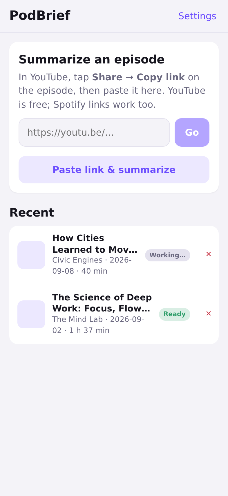
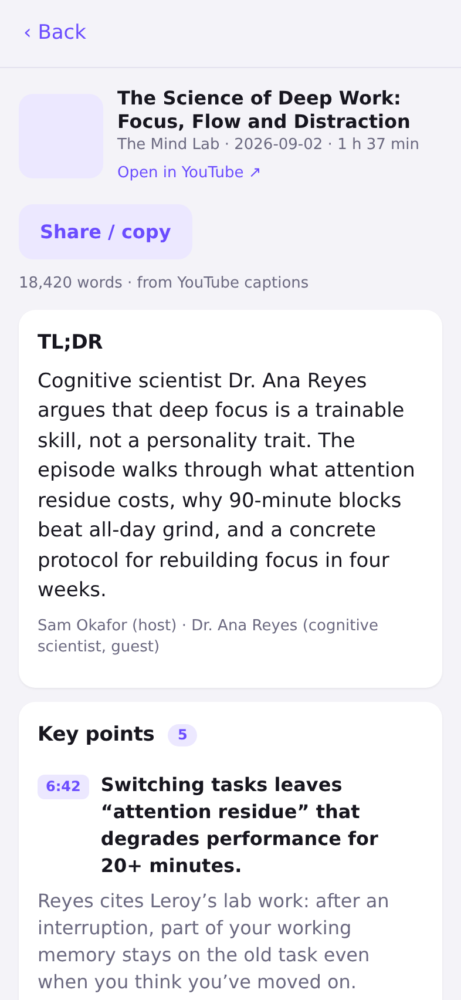
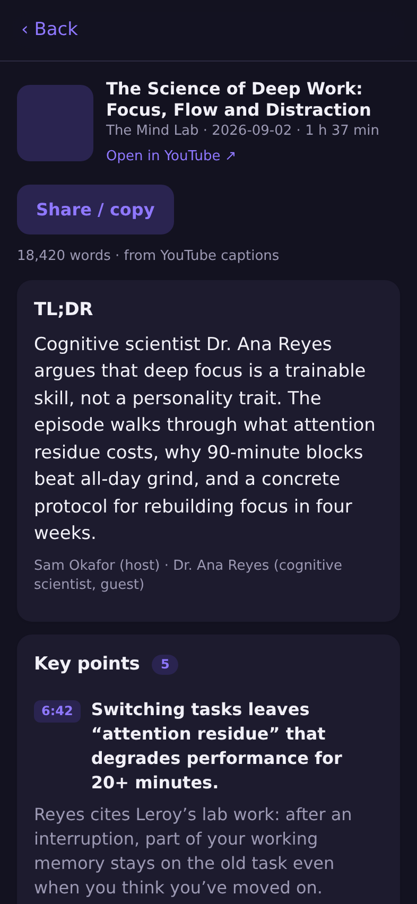

# PodBrief

Paste a YouTube or Spotify podcast link. Get every point from the episode,
with timestamps, in a couple of minutes — on your phone, as an app.

<p>
  
  
  
</p>

## What it does

1. **Reads the link.** YouTube share links (`youtu.be/…`, `watch?v=…`,
   `/live/…`) and Spotify episode links (share links, `spotify:episode:` URIs,
   `spotify.link` short links).
2. **Gets the words, free when it can.**
   - **YouTube:** the episode's captions are read straight from YouTube —
     uploaded ones if the channel has them, otherwise YouTube's auto-generated
     ones. No audio download, no transcription bill. If YouTube refuses the
     server (cloud IPs get rate-limited), the phone fetches the captions
     itself through public mirrors and hands them over; failing that, you can
     paste the transcript from YouTube's *Show transcript* panel.
   - **Spotify:** Spotify doesn't hand out podcast audio, so the show is looked
     up in the Apple Podcasts directory, its RSS feed fetched and the episode
     matched. A transcript published in the feed is used if there is one;
     otherwise the audio goes to AssemblyAI or OpenAI Whisper (paid, optional).
3. **Summarizes with Claude.** One structured request over the full
   timestamped transcript produces: a TL;DR, every key point with detail and a
   timestamp, chapters, quotes, action items, and everything mentioned.
   Timestamps deep-link back into YouTube or Spotify at that moment.
4. **Installs on an iPhone.** It's a Progressive Web App: Safari → Share →
   Add to Home Screen. Full screen, its own icon, and finished summaries are
   kept on the device so they open offline.

Jobs run on the server and the phone polls for progress, so you can lock the
screen while it works.

## What it costs

| | |
| --- | --- |
| YouTube captions | Free |
| Hosting (Render free plan) | Free |
| Claude Haiku 4.5 summary | About $0.06 per two-hour episode. Anthropic has no free tier; $5 of prepaid credit is roughly 80 episodes. |
| Spotify audio transcription | Only if you use Spotify links without a feed transcript: AssemblyAI signup credits, then ~$0.15–0.37 per hour of audio. |

## Running it

You need Node 22 and an Anthropic API key. That's enough for YouTube links.
Spotify links additionally want an AssemblyAI or OpenAI key, unless the show
publishes transcripts in its feed.

```bash
cd podcast-summarizer
npm install
cp .env.example .env    # fill in ANTHROPIC_API_KEY
npm run build
set -a; source .env; set +a
npm start               # http://localhost:8787
```

Open that address in Safari on your iPhone (on the same Wi-Fi, use your
computer's IP, e.g. `http://192.168.1.20:8787`) and **Add to Home Screen**.

### Development

```bash
npm run dev     # Vite on :5173 with the API proxied from :8787, both hot-reloading
npm test        # unit and pipeline tests (no network needed)
```

### One-click hosting (Render)

[](https://render.com/deploy?repo=https://github.com/Orion0900/Claude-orion)

The `render.yaml` at the repo root builds the Docker image and asks for your
`ANTHROPIC_API_KEY` (the AssemblyAI key can be left blank). You get an HTTPS
URL to open on the phone. The free plan sleeps when idle (first request takes ~30 s) and its
disk resets on deploy; summaries you've opened are kept on the phone anyway.

### Docker

```bash
docker build -t podbrief .
docker run -p 8787:8787 --env-file .env -v podbrief-data:/data podbrief
```

The image includes ffmpeg, which the OpenAI path needs to split episodes over
25 MB. Deploy it anywhere that runs a container (Fly.io, Railway, Render, a
Raspberry Pi) and the app is reachable from your phone anywhere, not just at
home. Put it behind HTTPS: iOS only registers the offline service worker on
secure origins (and `localhost`).

### Configuration

| Variable | Purpose |
| --- | --- |
| `ANTHROPIC_API_KEY` | Required. Claude writes the summaries. |
| `CLAUDE_MODEL` | Defaults to `claude-haiku-4-5` (~$0.06 per two-hour episode). Set `claude-opus-5` for the most thorough summaries (~$0.30). |
| `ASSEMBLYAI_API_KEY` | Optional, Spotify links only. Transcription from the audio URL; no size limit. |
| `OPENAI_API_KEY` | Optional, Spotify links only. Whisper transcription; needs ffmpeg over 25 MB. |
| `YOUTUBE_MIRRORS` | Optional. Comma-separated Invidious/Piped origins to try when YouTube blocks the server. |
| `SPOTIFY_CLIENT_ID` / `SPOTIFY_CLIENT_SECRET` | Optional. Uses the Spotify Web API for episode lookup instead of reading the public page. |
| `DATA_DIR` | Where `jobs.json` (finished summaries) lives. Default `./data`. |
| `PORT` | Default `8787`. |

The app can also be hosted separately from the API (e.g. on static hosting):
set the server address under **Settings** in the app. The API allows
cross-origin requests.

## API

| Method | Path | |
| --- | --- | --- |
| `POST` | `/api/jobs` | `{ "url": "https://youtu.be/…" }` → job (202) |
| `GET` | `/api/jobs/:id` | Job with `stage`, `message`, `episode`, and `summary` when done |
| `POST` | `/api/jobs/:id/source` | `{ "feedUrl" }` or `{ "audioUrl" }` when a job is `needs_source` |
| `POST` | `/api/jobs/:id/transcript` | `{ "text", "format"?, "source"? }` when a job is `needs_transcript` |
| `GET` | `/api/jobs` | All jobs, without summary bodies |
| `DELETE` | `/api/jobs/:id` | |
| `GET` | `/api/health` | Which providers are configured |

Stages: `queued → resolving → (finding_audio → transcribing) → summarizing → done`,
with `needs_transcript`, `needs_source` and `failed` as the stops.

## Layout

```
server/
  index.ts          Express API; serves the built web app in production
  jobs.ts           the pipeline, run as background jobs and persisted to JSON
  lib/
    youtube.ts      URL parsing, caption ladder (watch page, Innertube, mirrors)
    spotify.ts      URL parsing, episode page/Web API metadata
    feeds.ts        Apple directory search, RSS parsing, episode matching
    transcribe.ts   feed transcripts, AssemblyAI, OpenAI Whisper, rendering
    summarize.ts    Claude structured-output request and the summary schema
    text.ts         title normalization, similarity, durations
web/
  src/              React PWA: paste, progress, summary, history, settings
  src/captions.ts   phone-side caption fetch through mirrors when the server is blocked
  public/           manifest, service worker, icons (scripts/make-icons.mjs)
```

## Limits worth knowing

- YouTube rate-limits cloud servers. The ladder (watch page → Innertube →
  mirrors → your phone → paste) exists for that; expect the phone step to kick
  in sometimes on free hosting.
- A YouTube video with captions disabled has nothing to read; paste is the
  only route.
- Spotify-exclusive shows have no public RSS feed, so there's no audio to
  transcribe. The app will ask for a source it can't find.
- Episode lookup without Spotify API credentials reads the public episode
  page, which Spotify can change. Credentials make it robust.
- Transcription is the slow part: budget a few minutes per hour of audio.
  AssemblyAI gives signup credits, then charges per hour. The Claude call on a
  two-hour transcript costs a few cents on Haiku and about thirty on Opus.
